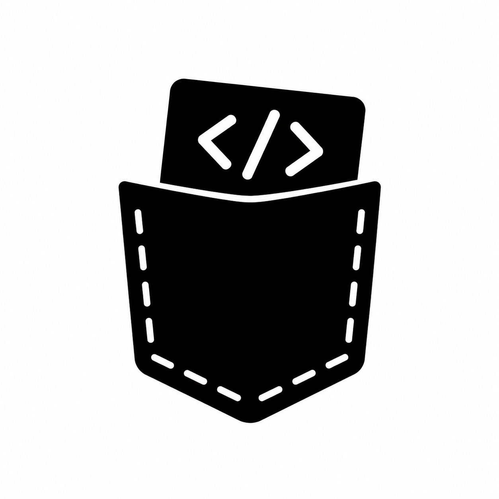

# PockCode

<p align="center">
  
</p>

<p align="center">
  <strong>A local Codex coding workspace for chat, files, terminals, providers, schedules, and remote follow-up.</strong>
</p>

<p align="center">
  <a href="https://www.npmjs.com/package/pockcode"></a>
  =20" src="https://img.shields.io/badge/node-%3E%3D20.0.0-339933?style=flat-square&logo=node.js&logoColor=white" />
  
</p>

PockCode runs a password-protected web workspace on your machine and gives Codex a focused interface for real coding work: persistent chats, workspace files, integrated terminals, Git operations, MCP servers, run actions, schedules, web push notifications, Cloudflare Tunnel sharing, and a Telegram companion plugin.

It is designed to stay local-first. The application server, SQLite database, auth file, provider settings, and terminal sessions run on your computer. You decide when to bind it beyond localhost or expose it through a tunnel.

## Contents

- [Highlights](#highlights)
- [Quick Start](#quick-start)
- [Installation](#installation)
- [Usage](#usage)
- [Configuration](#configuration)
- [Development](#development)
- [Testing](#testing)
- [Architecture](#architecture)
- [Security Model](#security-model)
- [Troubleshooting](#troubleshooting)
- [Publishing](#publishing)
- [License](#license)

## Highlights

- **Local Codex workspace**: manage Codex chats, model settings, reasoning effort, service tier, permissions, and collaboration mode from a browser UI.
- **Provider accounts**: connect Codex accounts through browser auth or an existing local Codex account, then switch between connected accounts per chat.
- **Workspace-aware chat**: attach files, folders, and images; use goals; run review and compaction; approve provider requests from the UI.
- **File browser and editor**: browse workspaces under your home directory, preview text files, and open code in a Monaco-powered editor.
- **Integrated terminals**: create persistent workspace terminals backed by `node-pty`, resize them live, and keep output available while you work.
- **Run actions**: save reusable workspace actions that launch a terminal command or send a chat prompt.
- **Git panel**: inspect status, initialize repositories, stage and unstage paths, commit, discard, pull, and push.
- **Scheduler**: create recurring Codex tasks with per-schedule model, permission, collaboration, and recurrence settings.
- **MCP management**: define MCP servers, configure transports and tool policy, sync them to provider accounts, and start OAuth login flows.
- **Cloudflare Tunnel support**: inspect named tunnels and start temporary `trycloudflare.com` tunnels when `cloudflared` is available.
- **Notifications**: receive browser push notifications when runs finish or fail.
- **Telegram plugin**: pair a Telegram bot to browse workspaces, subscribe to chat updates, and reply remotely.
- **PWA-ready shell**: install the app as a standalone browser app with first-class mobile viewport handling.

## Quick Start

Run the latest published package:

```sh
npx pockcode@latest
```

Then open:

```text
http://127.0.0.1:4733
```

On the first visit, PockCode asks you to create a local password. After that, sign in with the password, open or add a workspace, connect a Codex provider account, and start coding.

## Installation

### Requirements

- Node.js `20.0.0` or newer
- A Codex account or an existing local Codex login for provider-backed chats
- Git, if you want the Git panel
- `cloudflared`, if you want Cloudflare Tunnel features
- A Telegram bot token, if you enable the Telegram plugin

### Run Without Installing

```sh
npx pockcode@latest
```

Or with pnpm:

```sh
pnpm dlx pockcode
```

### Install Globally

```sh
npm install --global pockcode
pockcode
```

### Custom Host, Port, And Data Directory

```sh
pockcode --host 127.0.0.1 --port 4733 --home ~/.pockcode
```

CLI options:

```text
Usage: pockcode [options]

Options:
  -H, --host, --bind <host>  Host/interface to bind (default: 127.0.0.1)
  -p, --port <port>          Port to listen on (default: 4733)
      --home <path>          PockCode data directory (default: ~/.pockcode)
  -v, --version              Print version
  -h, --help                 Print help
```

To use PockCode from another device on your LAN, bind to all interfaces:

```sh
pockcode --host 0.0.0.0
```

Only do this on trusted networks and use a strong local password.

## Usage

### 1. Create The Local Password

PockCode is gated before the app and API load. The first browser visit prompts for a password and stores a scrypt-hashed record in the configured PockCode home directory.

### 2. Open A Workspace

Use the workspace picker to browse directories under your home folder. PockCode remembers recent workspaces and can reopen them on later sessions.

### 3. Connect Codex

Open **Providers**, add or select an OpenAI Codex account, then authenticate with:

- **Browser**: starts the Codex browser login flow.
- **Local account**: reuses a local Codex account when available.

You can configure account defaults such as model, reasoning effort, service tier, permission mode, Codex home, command, arguments, and environment.

### 4. Work In Chats

From the chat composer you can:

- Send a normal prompt.
- Toggle plan mode.
- Change access or permission mode.
- Attach files, folders, and images.
- Attach a goal to the next turn.
- Use slash commands for provider actions such as permissions, goals, review, compaction, and MCP management.
- Respond to provider requests without leaving the workspace.

### 5. Use Files, Git, Terminals, And Actions

The right panel includes:

- **Files**: workspace tree and text file previews.
- **Git**: status, commits, staging, commit, pull, push, and repository initialization.
- **Tunnels**: Cloudflare Tunnel status and temporary tunnel controls.

The terminal panel creates shell sessions in the active workspace. Run actions can save common terminal commands or chat prompts for repeat use.

### 6. Schedule Work

The scheduler can run Codex prompts later or on a recurrence. Each schedule stores its workspace, provider account, model, permission mode, collaboration mode, goal, recurrence, and run history.

### 7. Optional Remote Workflows

- Enable browser push notifications to get completion and failure alerts.
- Start a temporary Cloudflare Tunnel when you need secure remote browser access.
- Enable the Telegram plugin with a bot token to receive chat updates and reply from Telegram.

## Configuration

PockCode works with sensible defaults, but these environment variables are available:

| Variable | Default | Purpose |
| --- | --- | --- |
| `POCKCODE_HOME` | `~/.pockcode` | Data directory for the SQLite database, auth file, provider data, plugin state, and generated push keys. Equivalent to `--home`. |
| `PORT` | `4733` | Default port when `--port` is not provided. |
| `POCKCODE_CLIENT_DIR` | bundled `build/client` | Override the client build served by the production CLI. Useful for local packaging tests. |
| `POCKCODE_WEB_PUSH_PUBLIC_KEY` | generated and stored locally | VAPID public key for web push notifications. |
| `POCKCODE_WEB_PUSH_PRIVATE_KEY` | generated and stored locally | VAPID private key for web push notifications. |
| `POCKCODE_WEB_PUSH_SUBJECT` | `https://github.com/monokaijs/pockcode` | VAPID subject. Must be a public `https://` URL or a real `mailto:` address. |
| `VITE_HMR_HOST` | unset | Custom Vite HMR host for development behind a proxy or tunnel. |
| `VITE_HMR_CLIENT_PORT` | `443` | Custom Vite HMR client port when `VITE_HMR_HOST` is set. |
| `VITE_HMR_PROTOCOL` | `wss` | Custom Vite HMR protocol when `VITE_HMR_HOST` is set. |
| `POCKCODE_REAL_CODEX` | unset | Set to `1` to run the real Codex smoke test. |
| `CODEX_BIN` | `codex` | Codex executable used by the real Codex smoke test. |

The production server derives `DATABASE_URL` internally from `POCKCODE_HOME` and stores data in SQLite at:

```text
~/.pockcode/pockcode.db
```

With the default home, the auth file is:

```text
~/.pockcode/auth.json
```

## Development

Clone the repository and install dependencies:

```sh
corepack enable
pnpm install
```

Start the development server:

```sh
pnpm dev
```

Vite prints the local URL. The dev server installs the same API, provider socket, monitors, plugin manager, and web push bridge used by the app server.

Build the production client and CLI:

```sh
pnpm build
```

Run the built package locally:

```sh
pnpm preview
```

Useful scripts:

| Command | Description |
| --- | --- |
| `pnpm dev` | Start the Vite/React Router development server with API and socket middleware. |
| `pnpm build` | Type-check project references, build the browser client, and build the `pockcode` CLI. |
| `pnpm preview` | Serve the production build through `dist/pockcode.js`. |
| `pnpm test` | Run the Vitest suite. |
| `pnpm typecheck` | Run TypeScript without emitting files. |
| `pnpm test:real-codex` | Run the optional real Codex smoke test when `POCKCODE_REAL_CODEX=1`. |

## Testing

Run the standard checks before opening a pull request:

```sh
pnpm test
pnpm typecheck
pnpm build
```

The regular test suite uses Vitest. The real Codex smoke test is intentionally opt-in because it starts a Codex app server and expects a usable Codex environment:

```sh
POCKCODE_REAL_CODEX=1 pnpm test:real-codex
```

## Architecture

PockCode is split between a browser client, a Node.js app server, and a local SQLite store.

```text
.
|-- app/
|   |-- routes/          React Router routes and route-level API helpers
|   |-- server/          API handlers, auth, database setup, providers, plugins, Git, terminals, MCP, push, tunnels
|   `-- types/           Shared server/client contracts
|-- bin/
|   `-- pockcode.ts      Production CLI and HTTP server
|-- prisma/
|   `-- schema.prisma    SQLite schema and Prisma client model
|-- public/              PWA manifest, service worker, and icons
|-- scripts/             Smoke-test utilities
|-- server/              Install-time SQLite/Prisma setup helpers
|-- src/
|   |-- components/      Session UI, editor, terminal, provider, MCP, Git, and design-system components
|   |-- lib/             Client utilities, API client, Codex/session helpers, Monaco setup
|   `-- types/           Client-side TypeScript types
`-- vite*.config.ts      Development, client build, and CLI build configuration
```

Core runtime pieces:

| Area | Files |
| --- | --- |
| Production server | `bin/pockcode.ts` |
| API routing | `app/server/api.server.ts` |
| Auth | `app/server/auth.server.ts` |
| SQLite setup | `app/server/database.server.ts`, `app/server/prisma.server.ts`, `prisma/schema.prisma` |
| Codex provider | `app/server/providers/codex.server.ts` |
| Provider sockets | `app/server/socket.server.ts` |
| Terminals | `app/server/terminal.server.ts` |
| Git operations | `app/server/git.service.ts` |
| MCP servers | `app/server/mcp.service.ts` |
| Schedules | `app/server/message-schedules.service.ts`, `app/server/message-schedule-monitor.server.ts` |
| Plugins | `app/server/plugins/*`, `app/server/plugins.service.ts` |
| Web push | `app/server/web-push.service.ts` |
| Cloudflare Tunnel | `app/server/cloudflared.service.ts` |
| Main workspace UI | `src/components/session/*` |

## Security Model

PockCode is a local developer tool with access to your files, shell, Git repositories, provider credentials, and automation workflows. Treat it like an IDE plus an authenticated local server.

Important behavior:

- The server binds to `127.0.0.1` by default.
- The first visit requires local password setup before app assets and APIs are available.
- Password records are scrypt-hashed and stored in the PockCode home directory.
- Session cookies are HTTP-only and scoped to the PockCode server.
- Basic auth is also accepted for API-style access after a password is configured.
- Workspace browsing is constrained to paths under the current user's home directory.
- Terminal sessions execute real shell commands on your machine.
- Git operations mutate real repositories.
- Temporary Cloudflare tunnels expose your local PockCode server through a public URL while running.

Recommended practice:

- Keep the default localhost binding unless you need LAN or tunnel access.
- Use a strong password, especially with `--host 0.0.0.0` or Cloudflare Tunnel.
- Stop temporary tunnels when you are done.
- Avoid running PockCode on untrusted machines or networks.
- Back up `POCKCODE_HOME` if you rely on its chat, schedule, plugin, or provider state.

## Troubleshooting

### Port Already In Use

Choose another port:

```sh
pockcode --port 4734
```

### Prisma Client Or SQLite Setup Fails

Regenerate Prisma artifacts after installing dependencies:

```sh
pnpm install
pnpm exec prisma generate --schema=prisma/schema.prisma
```

### Native Terminal Module Fails To Load

`node-pty` is native. Use a supported Node.js version and reinstall dependencies:

```sh
node --version
pnpm install
```

### Cloudflare Tunnel Is Unavailable

Install `cloudflared` and make sure it is on `PATH`:

```sh
cloudflared --version
```

Temporary tunnels do not require a named-tunnel login. Named tunnel management may require:

```sh
cloudflared tunnel login
```

### Push Notifications Do Not Arrive

Check that:

- The app is served from a secure context. Localhost is allowed by browsers.
- Browser notification permission is granted.
- The service worker registered successfully.
- VAPID settings are valid if you override the generated keys.

### Codex Authentication Does Not Complete

Try the alternative auth mode in the provider account dialog:

- Browser auth for a fresh login.
- Local account auth if you already have Codex configured locally.

## Publishing

The repository includes a GitHub Actions workflow at `.github/workflows/publish.yml` for trusted npm publishing.

The workflow:

1. Runs from a selected branch.
2. Installs Node.js and pnpm from `packageManager`.
3. Bumps the package version.
4. Runs tests and production build.
5. Packs and smoke-tests the `pockcode` binary.
6. Pushes the release commit and tag.
7. Publishes the packed tarball to npm.

For local package inspection:

```sh
pnpm test
pnpm build
npm pack
```

## Contributing

Contributions should keep the local-first behavior, typed API contracts, and provider boundaries intact.

Before submitting changes:

- Run `pnpm test`.
- Run `pnpm typecheck`.
- Run `pnpm build` for changes that affect app startup, packaging, providers, Prisma, or UI assets.
- Keep unrelated formatting churn out of focused changes.
- Update this README when setup, configuration, CLI behavior, or user-facing workflows change.

## Project Status

PockCode is published as a `0.0.x` package and is actively evolving. Expect some internal APIs and UI flows to change before a stable `1.0` release.

## License

This repository does not currently include a license file.
