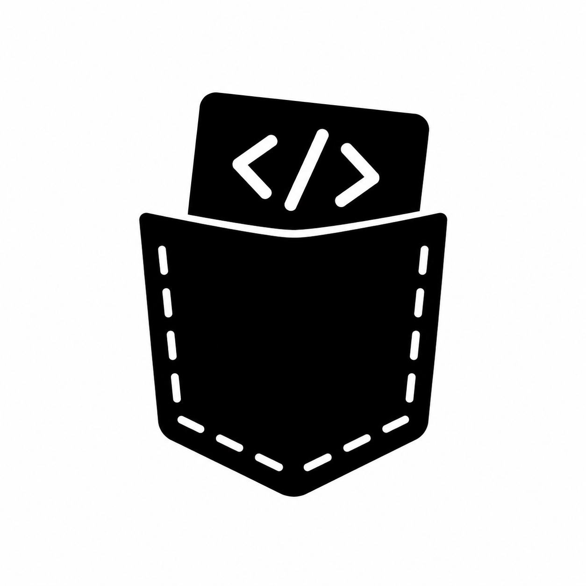

# PockCode

<p align="center">
  
</p>

<p align="center">
  <strong>A local Codex coding workspace for chat, providers, schedules, and remote follow-up.</strong>
</p>

<p align="center">
  <a href="https://www.npmjs.com/package/pockcode"></a>
  
  
</p>

PockCode runs a password-protected web workspace on your machine and gives Codex a focused interface for real coding work: persistent chats, linked file previews, MCP servers, schedules, web push notifications, and a Telegram companion plugin.

It is designed to stay local-first. The application server, SQLite database, auth file and provider settings run on your computer. You decide when to bind it beyond localhost or expose it through a tunnel.

## Contents

- [Highlights](#highlights)
- [Quick Start](#quick-start)
- [Installation](#installation)
- [Usage](#usage)
- [Configuration](#configuration)
- [Development](#development)
- [Testing](#testing)
- [Architecture](#architecture)
- [Security Model](#security-model)
- [Troubleshooting](#troubleshooting)
- [Publishing](#publishing)
- [License](#license)

## Highlights

- **Local Codex workspace**: manage Codex chats, model settings, reasoning effort, service tier, permissions, and collaboration mode from a browser UI.
- **Provider accounts**: connect Codex accounts through device-code sign-in, then switch between connected accounts per chat.
- **Pock assistant**: use natural chat to inspect projects and conversations, create or fork chats, send follow-ups, stop work, and move conversations between connected Codex accounts. Conversation history and action receipts stay in your local database.
- **Quota recovery**: enable automatic account failover per chat. When a run exhausts usage quota, PockCode preserves the conversation, chooses a connected Codex account with verified capacity, and continues the task.
- **Workspace-aware chat**: attach files, folders, and images; use goals; run review and compaction; approve provider requests from the UI.
- **Linked file previews**: open workspace file links from chat in a Monaco-powered editor.
- **Scheduler**: create recurring Codex tasks with per-schedule model, permission, collaboration, and recurrence settings.
- **MCP management**: define MCP servers, configure transports and tool policy, sync them to provider accounts, and start OAuth login flows.
- **Notifications**: receive browser push notifications when runs finish or fail.
- **Telegram plugin**: pair a Telegram bot to browse workspaces, subscribe to chat updates, and reply remotely.
- **PWA-ready shell**: install the app as a standalone browser app with first-class mobile viewport handling.

## Quick Start

Run the latest published package:

```sh
npx pockcode@latest
```

Then open:

```text
http://127.0.0.1:4733
```

On the first visit, PockCode asks you to create a local password. After that, sign in with the password, open or add a workspace, connect a Codex provider account, and start coding.

## Installation

### Requirements

- Node.js `20.0.0` or newer
- A Codex account with device-code sign-in enabled
- `cloudflared`, if you want Cloudflare Tunnel features
- A Telegram bot token, if you enable the Telegram plugin

### Run Without Installing

```sh
npx pockcode@latest
```

Or with pnpm:

```sh
pnpm dlx pockcode
```

### Install Globally

```sh
npm install --global pockcode
pockcode
```

### Custom Host, Port, And Data Directory

```sh
pockcode --host 127.0.0.1 --port 4733 --home ~/.pockcode
```

CLI options:

```text
Usage: pockcode [options]

Options:
  -H, --host, --bind <host>  Host/interface to bind (default: 127.0.0.1)
  -p, --port <port>          Port to listen on (default: 4733)
      --home <path>          PockCode data directory (default: ~/.pockcode)
  -v, --version              Print version
  -h, --help                 Print help
```

To use PockCode from another device on your LAN, bind to all interfaces:

```sh
pockcode --host 0.0.0.0
```

Only do this on trusted networks and use a strong local password.

## Usage

### 1. Create The Local Password

PockCode is gated before the app and API load. The first browser visit prompts for a password and stores a scrypt-hashed record in the configured PockCode home directory.

### 2. Open A Workspace

Use the workspace picker to browse directories under your home folder. PockCode remembers recent workspaces and can reopen them on later sessions.

### 3. Connect Codex

Open **Providers**, add or select an OpenAI Codex account, and choose **Sign in with device code**. Open the sign-in link and enter the code shown in the account dialog.

You can configure account defaults such as model, reasoning effort, service tier, permission mode, Codex home, command, arguments, and environment.

Codex model selectors use the connected account's Codex model catalog, including its default and reasoning options. They refresh when opened, when the app regains focus, and every five minutes while visible. Choose **Automatic (Codex default)** in account settings to follow Codex's default model; choosing a specific model keeps that preference. Catalog freshness and availability depend on the installed Codex runtime and account.

### 4. Work In Chats

From the chat composer you can:

- Send a normal prompt.
- Toggle plan mode.
- Change access or permission mode.
- Attach files, folders, and images.
- Attach a goal to the next turn.
- Use slash commands for provider actions such as permissions, goals, review, compaction, and MCP management.
- Respond to provider requests without leaving the workspace.

### 5. Open Linked Files

Click a workspace file link in chat to open its text preview in the editor. The workspace interface focuses on chat, with projects and navigation on the left. Project rows use shadcn/ui accordions: expand several projects at once to browse their chats without switching the current project. Projects and Recents also collapse independently. Hover a project row to reveal its new-chat button; it is also available on keyboard focus. Each expanded project initially fetches its four latest chats; use **Load more** for older chats. Recents includes chats across projects, and selecting a chat opens its project. A chat's **… → Archive** action removes it immediately while the API request runs in the background; a failed request restores the row and shows an error.

### Talk To Pock

Open **Home** and select **Pock** under **Agents** in the left sidebar and use your connected Codex accounts without a separate API key. For example:

- “Start a new chat in PockCode to investigate the failing tests. Enable automatic account failover.”
- “Review authentication in Project A and fix failing tests in Project B. Start a chat for each.”
- “Call yourself Nova and be concise and direct.”
- “What are my running chats working on?”
- “Send the authentication chat a follow-up asking it to check session expiry.”
- “Move the test-fix chat to an account that still has quota.”
- “Enable quota recovery for this chat.”

Use **+** beside **Agents** to create more agents with separate names, personalities, and persistent conversations. Select an agent in the Home sidebar to chat with it. Agents can run at the same time; stopping one leaves the others running. The original Pock profile and conversation are preserved when upgrading.

Agent chat works like a messenger. Before composing each reply, the agent must call `set_typing(true)` separately, then use `send_agent_message` to send a short message immediately. The server rejects sends that skip typing. It can send several separate messages during one turn; there is no automatic “Thinking” bubble or final recap. Sending a message clears typing, and typing also clears when work stops, fails, finishes, or the server restarts. Messages default to 1–3 sentences, with a 1,200-character limit per bubble. A user message keeps its Sent/Read status visible only while it is the last message in the conversation; after a reply, its receipt appears on hover or keyboard focus. Individual timestamps appear on hover or keyboard focus. Waiting messages become Read when included in the agent's next batch, not merely when received by the server.

When an agent starts a Codex task, it automatically saves a watch on that specific run. Completion, failure, or cancellation wakes the agent with the run's result; the agent decides whether to send a useful update. Watches follow account failover and do not confuse later work in the same chat with the original task. The server listens to run events and reconciles saved watches every ten seconds, independently of browser connections. No callback MCP server is required. Requests for quiet work can disable the watch.

Ask for a future reminder, scheduled task, or periodic check in agent chat. The agent uses `schedule_follow_up` with an explicit timestamp and optional repeating interval, interpreting your request in the browser's timezone. Saved commitments appear under **Watches and schedules** in the agent's details, where you can cancel them; the agent can also list and cancel them through chat. Due events wait for a busy agent and combine with its next message batch. Periodic checks can finish silently, and missed intervals produce one check instead of a backlog. Proactive messages use existing desktop notification subscriptions when enabled.

PockCode must be running for watches and schedules to execute. Pending commitments survive server restarts and reconcile on startup. A follow-up interrupted during execution is marked failed for review, preserving sent messages and action receipts rather than automatically repeating possible side effects. Cancelling a watch does not stop its coding task.

Send adds your bubble immediately with a sending indicator, clears and refocuses the composer, and lets you send the next message while delivery is pending. Failed sends remain in the transcript with Retry, using the same message ID to prevent duplicates. You can keep sending messages while an agent works. Follow-ups are saved immediately without interrupting the current turn. When that turn finishes, the agent reads all waiting messages together and decides whether to reply, perform actions, or ask for clarification. Later messages can correct earlier requests within that batch. **Stop** stops the active turn and cancels waiting messages for that agent. If a turn fails or the server restarts, waiting messages remain saved; send another message to continue them. Interrupted turns are not automatically replayed.

In Codex coding chats, Send queues a follow-up while a turn is running. Use Steer to send a draft or queued message to the active turn. Queued messages can be edited, reordered, or deleted before they start. Stop cancels the active turn and preserves the queue, including across server restarts; sending another message resumes the queue in order.

Every agent is global across all saved projects. Opening a project or coding chat does not pin Pock to it or silently select its next target. Name projects in your messages; Pock resolves their chats using live tools and asks for clarification when references are ambiguous. You can direct several projects in one message; their dispatched Codex tasks can run concurrently. Each management operation has an action receipt. New chats retain the normal approval settings, and follow-ups retain each chat's existing permissions. Stopping Pock stops further management actions; coding tasks it already started continue until you stop those chats.

You can set the assistant's name and personality during chat. For example, “Call yourself Nova”, “Be warmer and more conversational”, or “Keep replies short and direct”. These preferences are saved for that agent in the local database and survive reloads, restarts, and account failover. Click the avatar above the conversation to open the profile panel at the top right. Personality controls conversational style; it does not change coding permissions or tool access.

Each agent can have its own avatar. Use **Upload image** in the profile panel to choose a PNG, JPEG, or WebP image; uploads are cropped to a square. **Generate for me**, or a request in chat, lets the agent design and save an original vector avatar with its `generate_avatar` tool. Avatars persist with the agent's profile and appear in the conversation, profile panel, and sidebar.

The agent composer starts as a single line. Use **+** to attach files or images, or paste an image into the input. Previews appear above the composer and can be removed before sending. You can send attachments without additional text. Messages retain their attachments after a restart; recent images remain available for follow-up questions. Images and UTF-8 text/code files are supplied to the agent; other binary files are saved and downloadable but cannot be inspected directly in agent chat. Attach up to 10 files, at most 5 MB each and 10 MB total, per message.

Each agent's **context** consists of its own recent conversation history, its saved profile, completed actions in the current request, and live tool results about projects, chats, and account capacity. There is no dedicated knowledge base yet. A knowledge base would provide long-lived reference facts and documents that can be retrieved when relevant, instead of relying on recent chat history.

Quota recovery is opt-in per chat and runs on the server, including with the browser closed. It switches **Codex accounts**, preserving the provider thread and workspace; other provider types are currently unsupported. It skips exhausted, disconnected, already attempted, and unverifiable accounts. Temporary rate throttling, authentication failures, and network errors do not trigger migration. If every eligible account is unavailable, the run fails with an explanation. Continuation prompts ask Codex to inspect completed work before proceeding; already executed external actions cannot be rolled back automatically.

The assistant itself can switch to another connected account if its quota runs out. Its management runtime uses read-only filesystem access, disables configured MCP servers and shell tools, and exposes a bounded set of chat-management tools. History and completed action receipts survive restarts, but in-flight assistant requests are not automatically replayed. PockCode must remain running for background work and account recovery.

The persistent conversation and visible action lifecycle are inspired by [OpenDots](https://github.com/CopilotKit/OpenDots) and [OpenAI Dots](https://learn.chatgpt.com/docs/dots), implemented using PockCode's existing local services and Codex app-server protocol.

### 6. Schedule Work

The scheduler can run Codex prompts later or on a recurrence. Each schedule stores its workspace, provider account, model, permission mode, collaboration mode, goal, recurrence, and run history.

### 7. Optional Remote Workflows

- Enable browser push notifications to get completion and failure alerts.
- Enable the Telegram plugin with a bot token to receive chat updates and reply from Telegram.

## Configuration

PockCode works with sensible defaults, but these environment variables are available:

| Variable | Default | Purpose |
| --- | --- | --- |
| `POCKCODE_HOME` | `~/.pockcode` | Data directory for the SQLite database, auth file, provider data, plugin state, and generated push keys. Equivalent to `--home`. |
| `PORT` | `4733` | Default port when `--port` is not provided. |
| `POCKCODE_CLIENT_DIR` | bundled `build/client` | Override the client build served by the production CLI. Useful for local packaging tests. |
| `POCKCODE_WEB_PUSH_PUBLIC_KEY` | generated and stored locally | VAPID public key for web push notifications. |
| `POCKCODE_WEB_PUSH_PRIVATE_KEY` | generated and stored locally | VAPID private key for web push notifications. |
| `POCKCODE_WEB_PUSH_SUBJECT` | `https://github.com/monokaijs/pockcode` | VAPID subject. Must be a public `https://` URL or a real `mailto:` address. |
| `VITE_HMR_HOST` | unset | Custom Vite HMR host for development behind a proxy or tunnel. |
| `VITE_HMR_CLIENT_PORT` | `443` | Custom Vite HMR client port when `VITE_HMR_HOST` is set. |
| `VITE_HMR_PROTOCOL` | `wss` | Custom Vite HMR protocol when `VITE_HMR_HOST` is set. |
| `POCKCODE_REAL_CODEX` | unset | Set to `1` to run the real Codex smoke test. |
| `CODEX_BIN` | `codex` | Codex executable used by the real Codex smoke test. |

The production server derives `DATABASE_URL` internally from `POCKCODE_HOME` and stores data in SQLite at:

```text
~/.pockcode/pockcode.db
```

With the default home, the auth file is:

```text
~/.pockcode/auth.json
```

## Development

Clone the repository and install dependencies:

```sh
corepack enable
pnpm install
```

Start the development server:

```sh
pnpm dev
```

Vite prints the local URL. The dev server installs the same API, provider socket, monitors, plugin manager, and web push bridge used by the app server.

Build the production client and CLI:

```sh
pnpm build
```

Run the built package locally:

```sh
pnpm preview
```

Useful scripts:

| Command | Description |
| --- | --- |
| `pnpm dev` | Start the Vite/React Router development server with API and socket middleware. |
| `pnpm build` | Type-check project references, build the browser client, and build the `pockcode` CLI. |
| `pnpm preview` | Serve the production build through `dist/pockcode.js`. |
| `pnpm test` | Run the Vitest suite. |
| `pnpm typecheck` | Run TypeScript without emitting files. |
| `pnpm test:real-codex` | Run the optional real Codex smoke test when `POCKCODE_REAL_CODEX=1`. |

## Testing

Run the standard checks before opening a pull request:

```sh
pnpm test
pnpm typecheck
pnpm build
```

The regular test suite uses Vitest. The real Codex smoke test is intentionally opt-in because it starts a Codex app server and expects a usable Codex environment:

```sh
POCKCODE_REAL_CODEX=1 pnpm test:real-codex
```

## Architecture

PockCode is split between a browser client, a Node.js app server, and a local SQLite store.

```text
.
|-- app/
|   |-- routes/          React Router routes and route-level API helpers
|   |-- server/          API handlers, auth, database setup, providers, plugins, Git, MCP, push, tunnels
|   `-- types/           Shared server/client contracts
|-- bin/
|   `-- pockcode.ts      Production CLI and HTTP server
|-- prisma/
|   `-- schema.prisma    SQLite schema and Prisma client model
|-- public/              PWA manifest, service worker, and icons
|-- scripts/             Smoke-test utilities
|-- server/              Install-time SQLite/Prisma setup helpers
|-- src/
|   |-- components/      Session UI, editor, provider, MCP, and design-system components
|   |-- lib/             Client utilities, API client, Codex/session helpers, Monaco setup
|   `-- types/           Client-side TypeScript types
`-- vite*.config.ts      Development, client build, and CLI build configuration
```

Core runtime pieces:

| Area | Files |
| --- | --- |
| Production server | `bin/pockcode.ts` |
| API routing | `app/server/api.server.ts` |
| Auth | `app/server/auth.server.ts` |
| SQLite setup | `app/server/database.server.ts`, `app/server/prisma.server.ts`, `prisma/schema.prisma` |
| Codex provider | `app/server/providers/codex.server.ts` |
| Provider sockets | `app/server/socket.server.ts` |
| Git operations | `app/server/git.service.ts` |
| MCP servers | `app/server/mcp.service.ts` |
| Schedules | `app/server/message-schedules.service.ts`, `app/server/message-schedule-monitor.server.ts` |
| Plugins | `app/server/plugins/*`, `app/server/plugins.service.ts` |
| Web push | `app/server/web-push.service.ts` |
| Cloudflare Tunnel | `app/server/cloudflared.service.ts` |
| Main workspace UI | `src/components/session/*` |

## Security Model

PockCode is a local developer tool with access to your files, shell, Git repositories, provider credentials, and automation workflows. Treat it like an IDE plus an authenticated local server.

Important behavior:

- The server binds to `127.0.0.1` by default.
- The first visit requires local password setup before app assets and APIs are available.
- Password records are scrypt-hashed and stored in the PockCode home directory.
- Session cookies are HTTP-only and scoped to the PockCode server.
- Basic auth is also accepted for API-style access after a password is configured.
- Workspace browsing is constrained to paths under the current user's home directory.
- Git operations mutate real repositories.
- Temporary Cloudflare tunnels expose your local PockCode server through a public URL while running.

Recommended practice:

- Keep the default localhost binding unless you need LAN or tunnel access.
- Use a strong password, especially with `--host 0.0.0.0` or Cloudflare Tunnel.
- Stop temporary tunnels when you are done.
- Avoid running PockCode on untrusted machines or networks.
- Back up `POCKCODE_HOME` if you rely on its chat, schedule, plugin, or provider state.

## Troubleshooting

### Port Already In Use

Choose another port:

```sh
pockcode --port 4734
```

### Prisma Client Or SQLite Setup Fails

Regenerate Prisma artifacts after installing dependencies:

```sh
pnpm install
pnpm exec prisma generate --schema=prisma/schema.prisma
```

### Cloudflare Tunnel Is Unavailable

Install `cloudflared` and make sure it is on `PATH`:

```sh
cloudflared --version
```

Temporary tunnels do not require a named-tunnel login. Named tunnel management may require:

```sh
cloudflared tunnel login
```

### Push Notifications Do Not Arrive

Check that:

- The app is served from a secure context. Localhost is allowed by browsers.
- Browser notification permission is granted.
- The service worker registered successfully.
- VAPID settings are valid if you override the generated keys.

### Codex Authentication Does Not Complete

Use **Re-authenticate** to request a fresh device code, open the sign-in link, and enter the displayed code. Device-code sign-in must be enabled for your ChatGPT account.

## Publishing

The repository includes a GitHub Actions workflow at `.github/workflows/publish.yml` for trusted npm publishing.

The workflow:

1. Runs from a selected branch.
2. Installs Node.js and pnpm from `packageManager`.
3. Bumps the package version.
4. Runs tests and production build.
5. Packs and smoke-tests the `pockcode` binary.
6. Pushes the release commit and tag.
7. Publishes the packed tarball to npm.

For local package inspection:

```sh
pnpm test
pnpm build
npm pack
```

## Contributing

Contributions should keep the local-first behavior, typed API contracts, and provider boundaries intact.

Before submitting changes:

- Run `pnpm test`.
- Run `pnpm typecheck`.
- Run `pnpm build` for changes that affect app startup, packaging, providers, Prisma, or UI assets.
- Keep unrelated formatting churn out of focused changes.
- Update this README when setup, configuration, CLI behavior, or user-facing workflows change.

## Project Status

PockCode is published as a `0.0.x` package and is actively evolving. Expect some internal APIs and UI flows to change before a stable `1.0` release.

## License

This repository does not currently include a license file.
